# คู่มือการติดตั้งโปรเจกต์ ระบบจัดการร้านซักรีด (Laundary System)

## ส่วนที่ 1: ติดตั้ง SQL Server 2019

### ดาวน์โหลดที่ https://drive.google.com/drive/folders/1irIl3hucADoWOF18coyQ2ZGdMmAnPcH-

### 1) หลังจากเข้าลิงค์ googledrive จะเห็นไฟล์ตามภาพให้ทำการกดดาวน์โหลดมาไว้บนเครื่อง
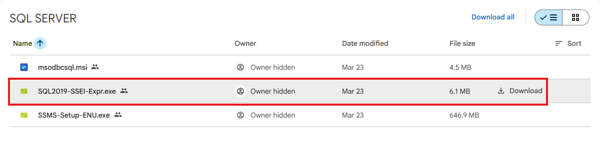

### 2) หลังจากคลิกที่ไฟล์ที่เราดาวน์โหลดมา จะปรากฏดังภาพ ให้เราทำการเลือกไปที่ "Download Media"
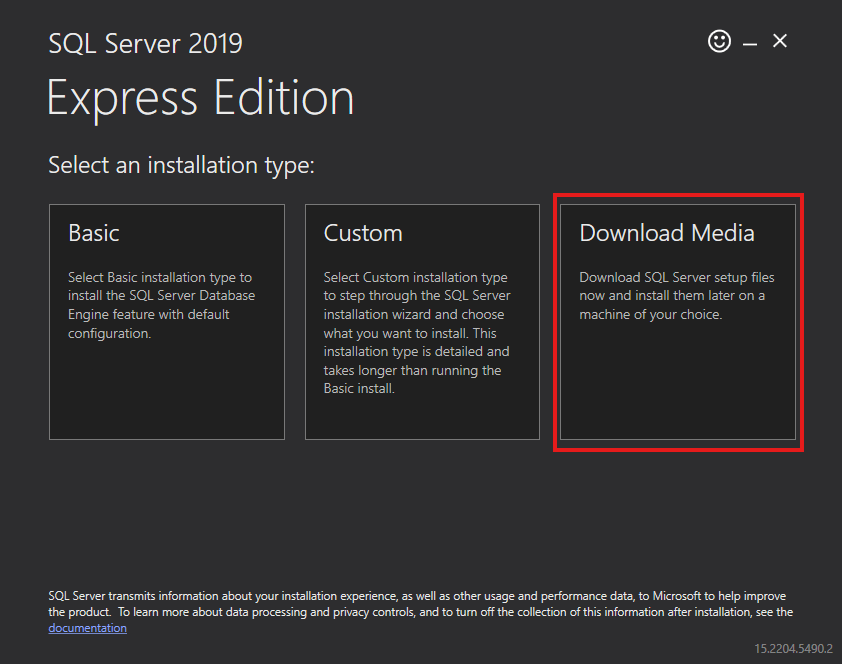

### 3) เลือกเป็นประเภท "Express Advanced" เเละทำการเลือก path หรือสร้างโฟลเดอร์ใหม่ ที่เราจะทำการติดตั้ง ดังภาพ
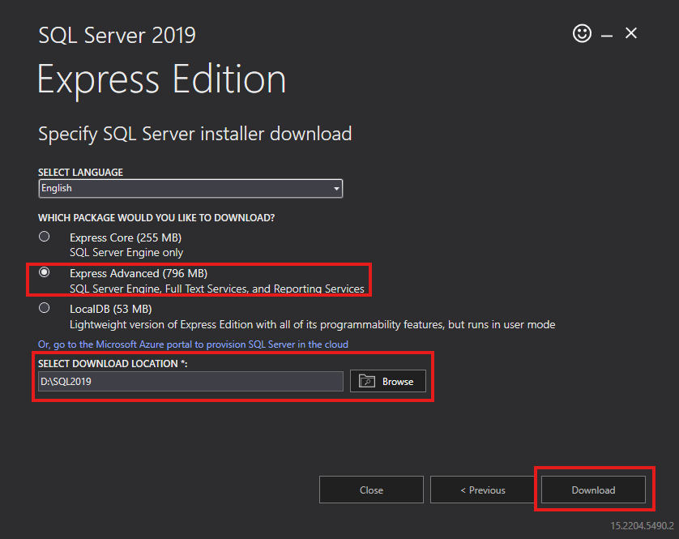

### 4) เมื่อขึ้น "Download successful!" ให้ทำกด "Open folder"
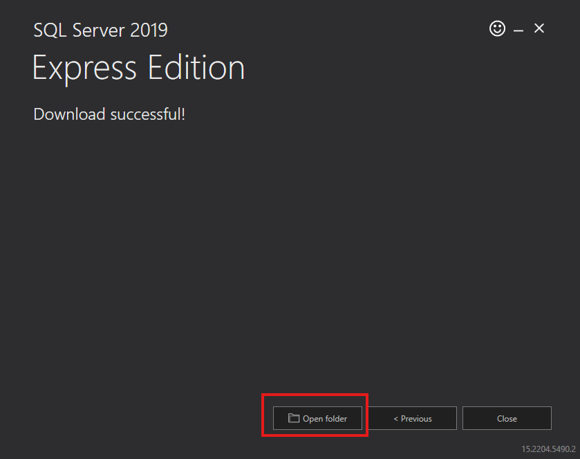

### 5) หลังจากเข้าโฟลเดอร์มาจะพบไฟล์ดังภาพ ให้ทำการดับเบิ้ลคลิก
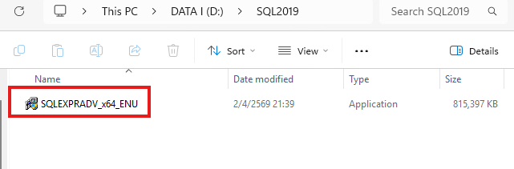

### 6) ทำการคลิก "OK" เพื่อทำการเเตกไฟล์ในโฟลเดอร์
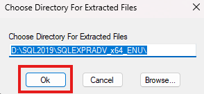

### 7) ทำการคลิกที่ "New SQL SERVER stand-alone installation or add features to an existing installation" 
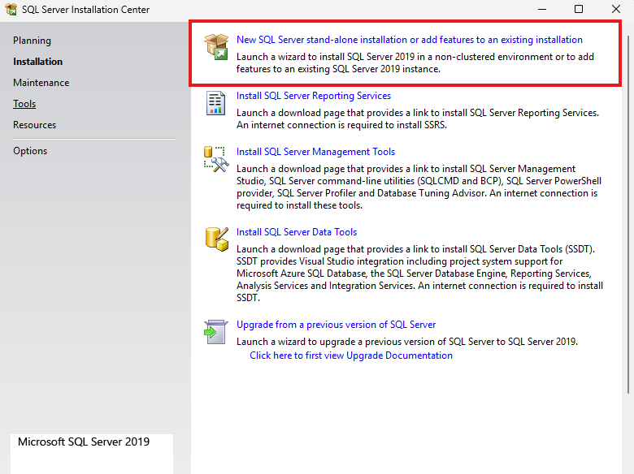

### 8) ให้ทำการติ้กที่ "I accept the license terms and Policy Statement"
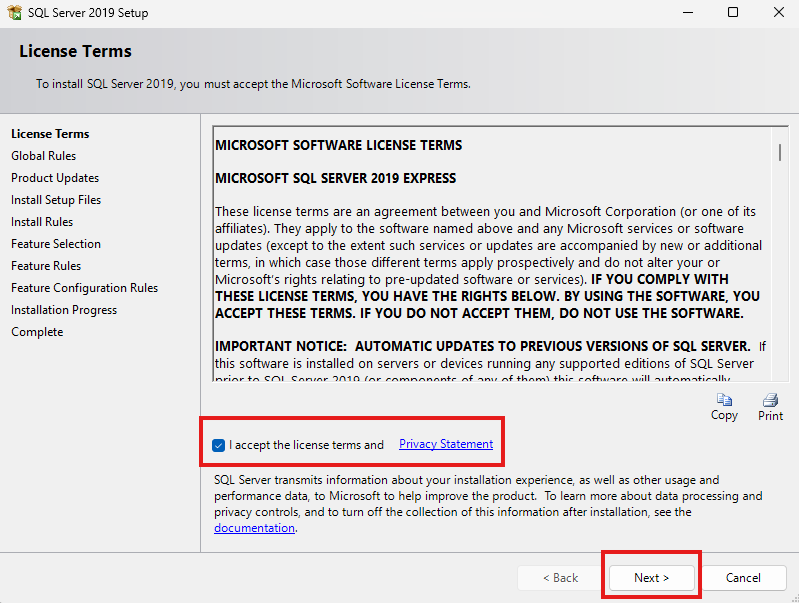

### 9) เมื่อปรากฏหน้าต่างดังภาพให้ทำการกด "Next"
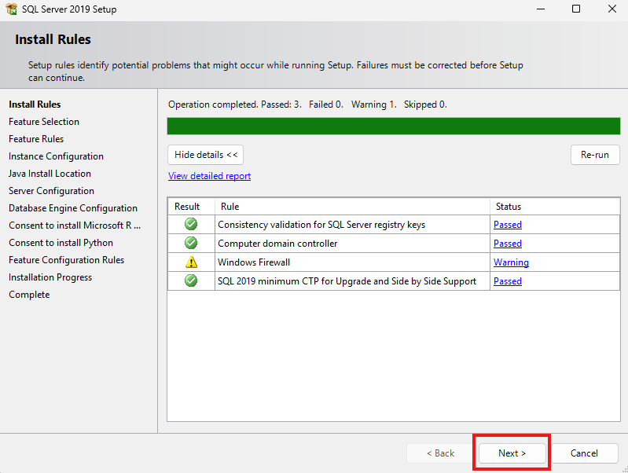

### 10) นำเครื่องหมายติ้กในช่องสี่เหลี่ยมเเดงตามภาพออกทั้งหมด -นอกนั้นให้คงเดิมไว้- จากนั้นกด "Next"
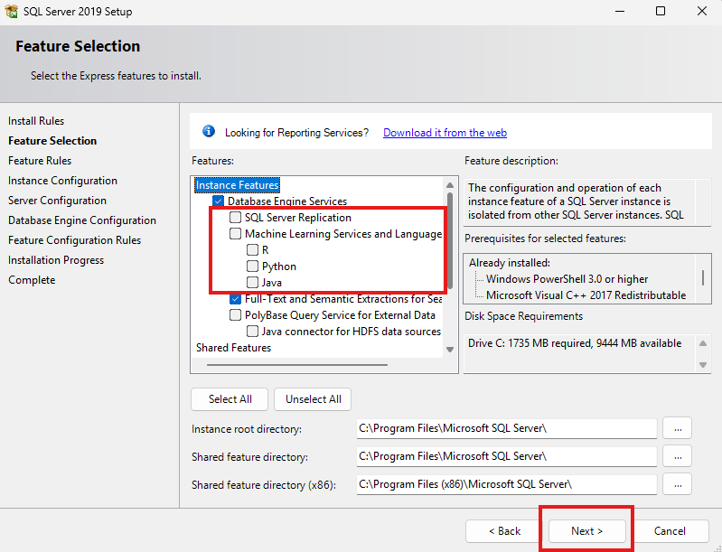

### 11) ตั้งชื่อ instance ว่า "SQLExpress2019" จากนั้นกด Next
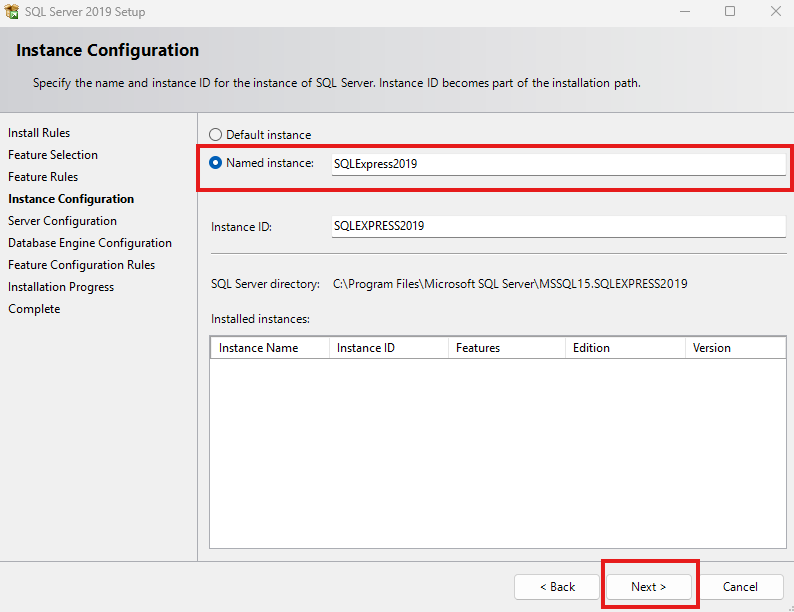

### 12) เมื่อปรากฏหน้าต่างดังภาพให้ทำการกด "Next"
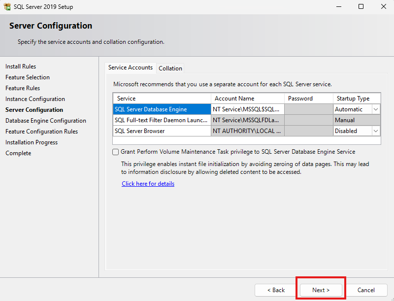

### 13) เลือก Authentication Mode เป็น "Mixed Mode" จากนั้นทำการใส่รหัสผ่านเพื่อเข้าผ่าน user: sa จากนั้นกด "Next"
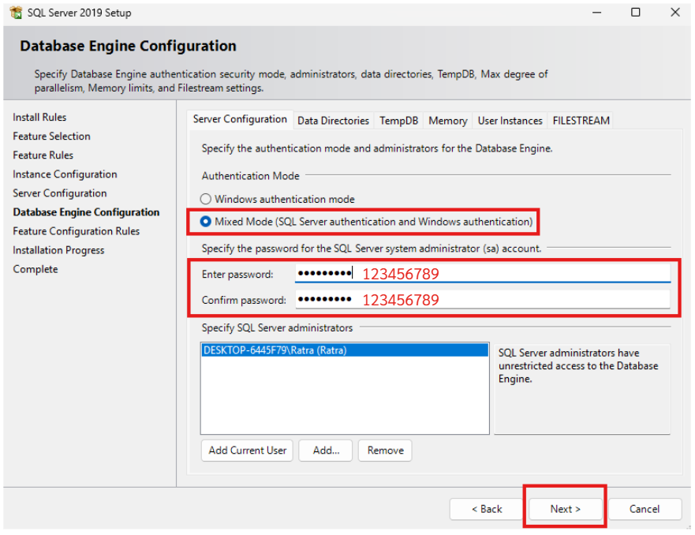

### 14) ติดตั้ง SQL Server 2019 เสร็จสิ้น ทำการกด "close"
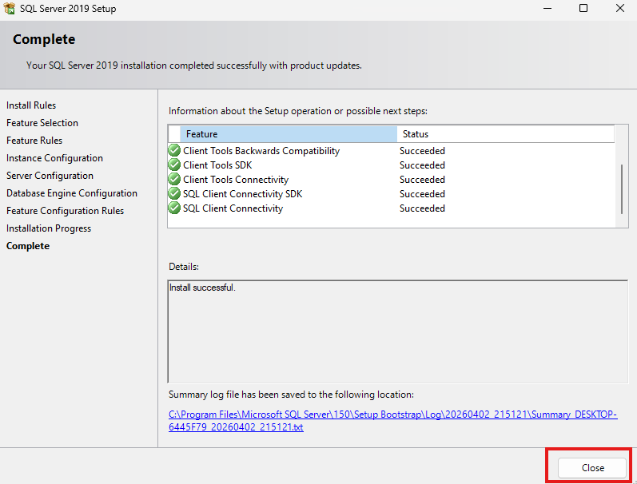

---

## ส่วนที่ 2: ติดตั้ง SQL Server Management Studio 19

### ดาวน์โหลดที่ https://drive.google.com/drive/folders/1irIl3hucADoWOF18coyQ2ZGdMmAnPcH-

### 1) หลังจากเข้าลิงค์ googledrive จะเห็นไฟล์ตามภาพให้ทำการกดดาวน์โหลดมาไว้บนเครื่อง
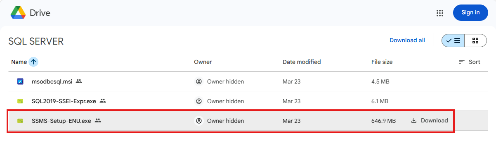

### 2) หลังจากคลิกที่ไฟล์จะปรากฏหน้าดังกล่าว ให้ทำการเลือก path ที่ต้องการติดตั้งไฟล์จากนั้นกด "install"
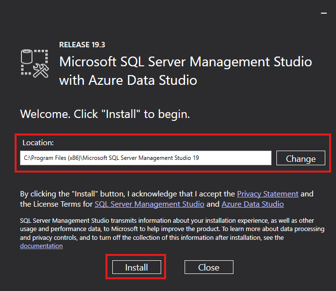

### 2) รอติดตั้ง เมื่อติดตั้งเสร็จสิ้นเรียบร้อยให้ทำการกด "close"
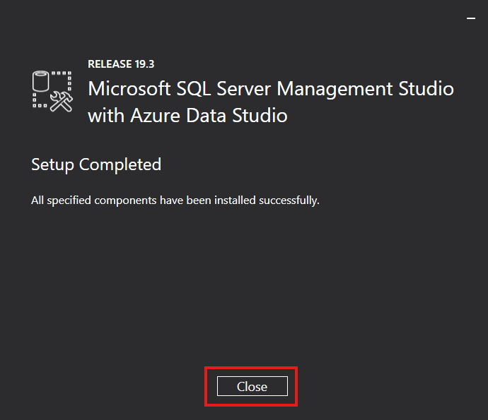

---

## ส่วนที่ 3: ติดตั้ง OBDC Driver 17 for SQL Server

### ดาวน์โหลดที่ https://drive.google.com/drive/folders/1irIl3hucADoWOF18coyQ2ZGdMmAnPcH-

### 1) หลังจากเข้าลิงค์ googledrive จะเห็นไฟล์ตามภาพให้ทำการกดดาวน์โหลดมาไว้บนเครื่อง
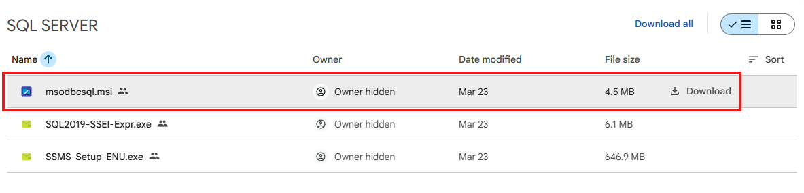

### 2) เมื่อปรากฏหน้าต่างดังภาพให้ทำการกด "Next"
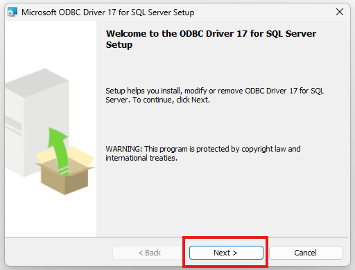

### 3) เลือกไปที่ "Modify" จากนั้น "Next"
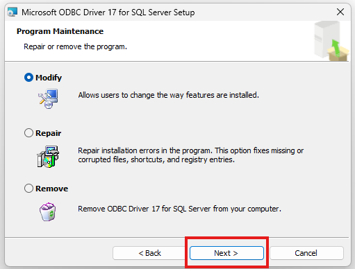

### 4) เมื่อปรากฏหน้าต่างดังภาพให้ทำการกด "Next"
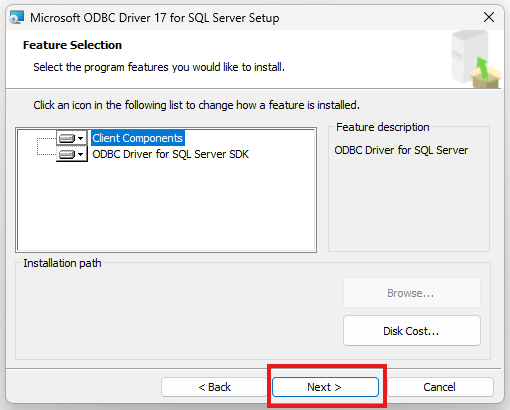

### 5) เมื่อปรากฏหน้าต่างดังภาพให้ทำการกด "Install"
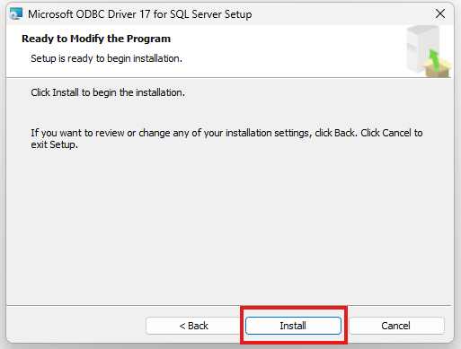

### 6) ติดตั้งเสร็จสิ้น ทำการกด "Finish"
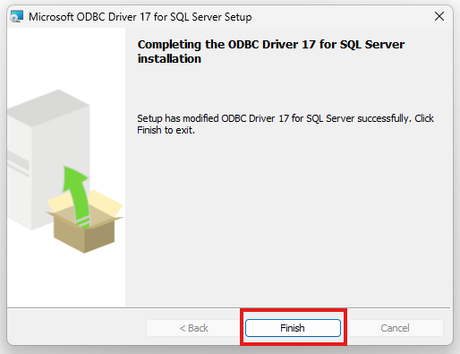

---

## ส่วนที่ 4: วิธีติดตั้ง Python บน Windows

### 1) เข้าเว็บดาวน์โหลด Python

ให้เปิดเว็บทางการของ Python:

[https://www.python.org/downloads/](https://www.python.org/downloads/)

เมื่อเข้าไปแล้ว จะเห็นหน้าดาวน์โหลดหลัก

---

### 2) วิธีดาวน์โหลด

ในหน้า Downloads ให้มองหาปุ่มสำหรับ Windows แล้วกดดาวน์โหลดตามที่หน้าเว็บแสดง

โดยทั่วไปสามารถกดปุ่มประมาณนี้:

- **Download Python install manager**

หรือถ้าต้องการไฟล์ติดตั้งแบบ `.exe` โดยตรง ให้เข้าไปที่:

[https://www.python.org/downloads/windows/](https://www.python.org/downloads/windows/)

แล้วเลือก:

- **Download Windows installer (64-bit)**

### 3) วิธีติดตั้ง Python

หลังจากดาวน์โหลดไฟล์เสร็จแล้ว ให้ทำตามนี้

- ไปที่โฟลเดอร์ **Downloads**
- ดับเบิลคลิกไฟล์ที่ดาวน์โหลดมา
- ถ้ามีหน้าติดตั้งเด้งขึ้นมา ให้กด **Install**
- รอจนติดตั้งเสร็จ

เมื่อติดตั้งเสร็จแล้ว ให้ปิดหน้าต่างติดตั้งได้เลย

### 4) วิธีเช็กว่าเครื่องมี Python อยู่แล้วหรือยัง

ทำการเปิด Command Prompt

- กดปุ่ม **Start**
- พิมพ์คำว่า **cmd**
- กดเข้า **Command Prompt**

จากนั้นพิมพ์คำสั่งนี้

```bash
python --version
```

หรือใช้คำสั่ง

```bash
py--version
```

ถ้าติดตั้งแล้ว จะปรากฏดังภาพ เช่น

```bash
Python 3.13.3
```

## ส่วนที่ 5: เช็กว่า pip ติดตั้งแล้วหรือยัง

pip คือเครื่องมือสำหรับติดตั้งไลบรารีของ Python ให้พิมพ์คำสั่งนี้ใน Command Prompt

```bash
pip --version
```

ถ้าขึ้นข้อความดังใต้ภาพเเสดงว่าใช้งานได้เเล้ว

```bash
pip 25.x from ...
```
---


## ส่วนที่ 6: ติดตั้งโปรเจ็คลงบนเครื่อง

### 1) ดาวน์โหลดไฟล์ ZIP จาก GitHub

- เข้าไปที่หน้าโปรเจกต์บน GitHub
- กดปุ่ม **Code**
- เลือก **Download ZIP**
- รอให้ดาวน์โหลดเสร็จ

### 2) แตกไฟล์ ZIP

- ไปที่โฟลเดอร์ **Downloads**
- คลิกขวาที่ไฟล์ ZIP
- เลือก **Extract All...**
- เลือกตำแหน่งที่ต้องการแตกไฟล์
- กด **Extract**

### 3) เปิดโปรเจกต์ใน VS Code

- เปิดโปรแกรม **Visual Studio Code**
- กด **File > Open Folder**
- เลือกโฟลเดอร์โปรเจกต์ที่แตกไฟล์ไว้
- กด **Select Folder**

### 4) เปิด Terminal ใน VS Code
- สังเกตุเเถบเมนูด้านบนจะพบคำว่า **Terminal**
- ทำการคลิกเเละเลือก **New Terminal**

### 5) ติดตั้ง Library พื้นฐาน สำหรับเชื่อมต่อฐานข้อมูล

โดยใช้คำสั่งดังนี้

```bash
pip install django mssql-django django-crispy-forms crispy-bootstrap5 openpyxl
```

หรือให้ error ให้ใช้คำสั่งนี้เเทน

```bash
python -m pip install django mssql-django django-crispy-forms crispy-bootstrap5 openpyxl
```
รอจนติดตั้งเสร็จ

### 6) เข้าโปรเเกรม SQL Server Management Studio 19 เพื่อนำเข้าฐานข้อมูล

- ทำการเข้าโปรเเกรม SQL Server Management Studio 19 จะปรากฏดังภาพ
- ทำการเข้าด้วยสิทธิ์ user : sa ที่ได้ตั้งค่าไว้ พร้อมใส่รหัส 123456789
-จากนั้นทำการกด "Connect"

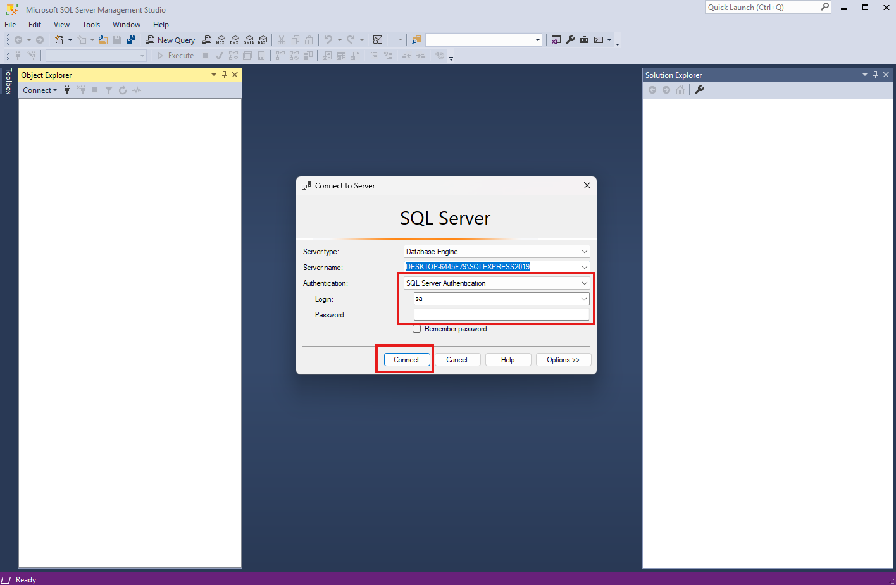

### 7) นำข้อมูลเข้า (Restore Database)

- หลังจากเข้าโปรเเกรมได้เเล้ว ให้ไปที่เเถบ Object Explorer เเล้วทำการคลิกขวาที่ Database จากนั้นคลิก "Restore Database..." <br><br>

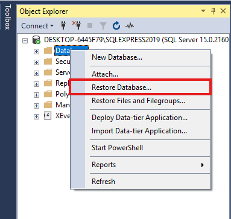<br><br>

- หลังจากขั้นตอนก่อนหน้าจะปรากฏหน้าต่างดังนี้ ให้ทำการคลิกไปที่ Device เเล้วเลือกที่ ...<br><br>

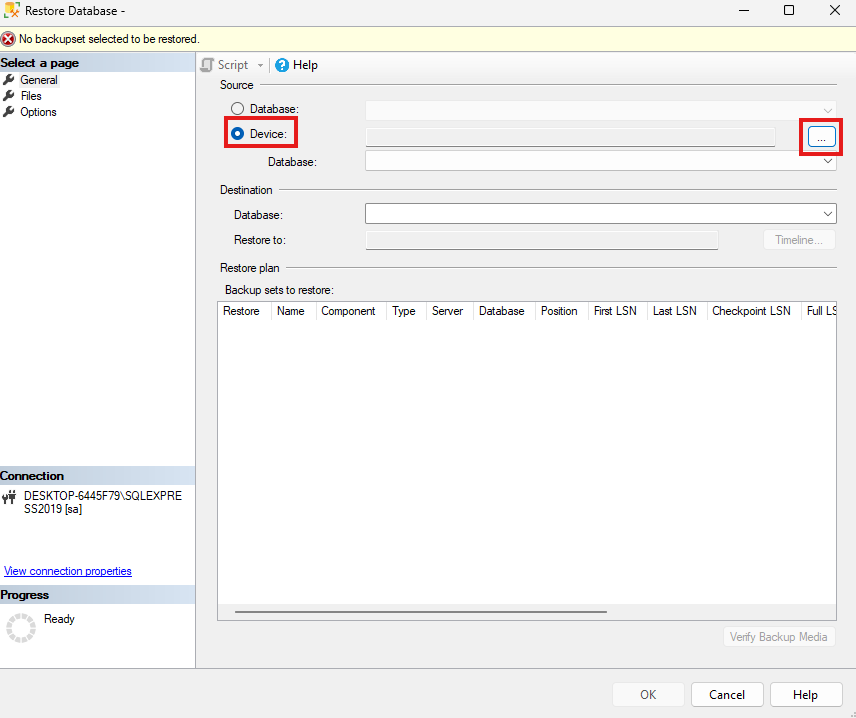<br><br>

- จากนั้นจะปรากฏหน้านี้ให้ทำการคลิกที่ Add<br><br>

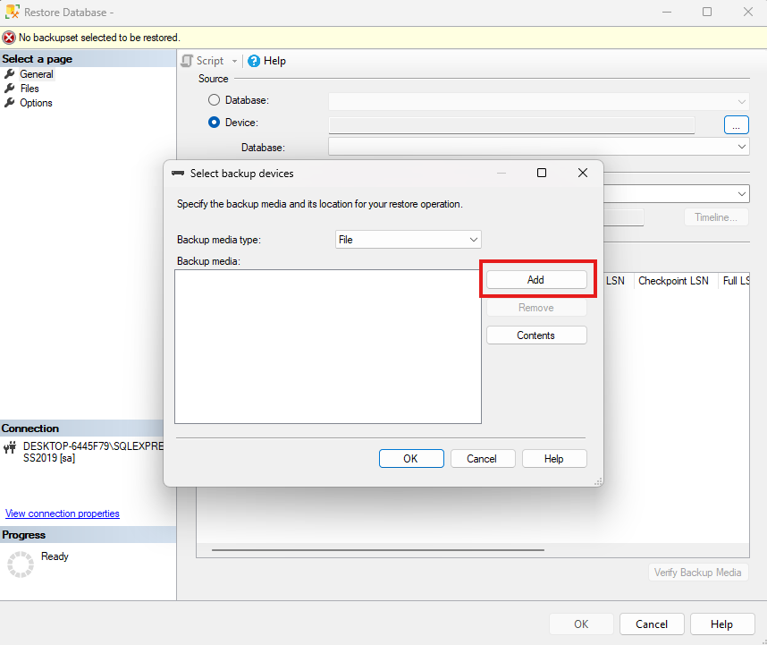<br><br>

- จากนั้นให้ไปที่ path ที่เราได้เเตกไฟล์ zip ที่ดาวน์โหลดมาไว้จะสังเกตุมาจะมีไฟล์ LaundryDB.bak ให้ทำการคลิกจากนั้นกด OK <br><br>
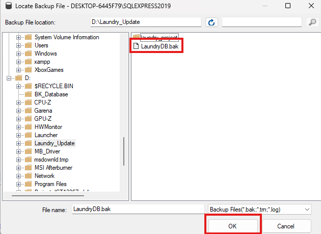<br><br>

- เมื่อนำเข้าไฟล์ Database เสร็จสิ้นจะปรากฏดังภาพ ให้ทำการกด OK <br><br>

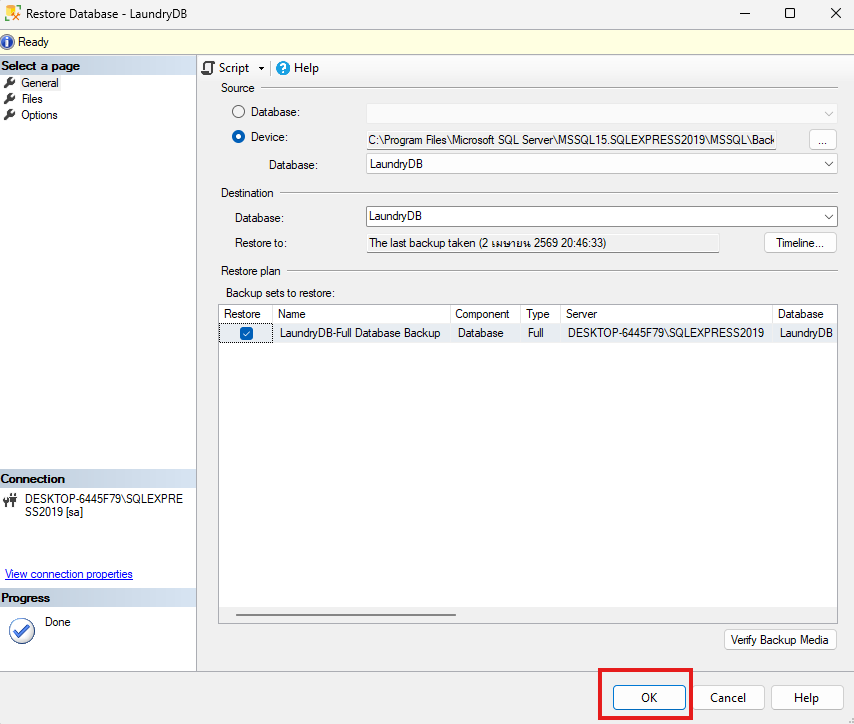<br><br>

- จะปรากฏภาพ database ที่เราได้ทำการ Restore มา<br><br>

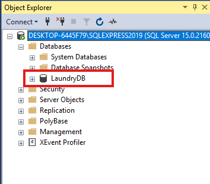<br><br>

### 8) ตั้งค่าการเชื่อมต่อใน `settings.py` ในโฟลเดอร์โปรเจ็ค
ไปที่ `Laundry_Project-main>>laundry_project>>laundry_project>>settings.py` แก้ไขส่วน `DATABASES` ให้ตรงกับเครื่อง:

```python
DATABASES = {
    'default': {
        'ENGINE': 'mssql',
        'NAME': 'LaundryDB',
        'USER': 'sa',
        'PASSWORD': '123456789',
        'HOST': 'ใส่ชื่อ device ตัวเอง เช่น DESKTOP-6445F79\\SQLEXPRESS2019',  
        'PORT': '',
        'OPTIONS': {
            'driver': 'ODBC Driver 17 for SQL Server',
            'extra_params': 'TrustServerCertificate=yes;',
        },
    }
}
```

- โดยสังเกตุ ชื่อ device จากภาพที่เราได้เข้า SSMS ใน **settings.py** ต้องใส่ \ 2 อัน <br><br>

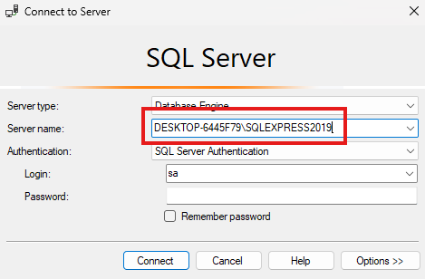<br><br>

### 9) เริ่มใช้งานระบบ

- ทำการ cd เข้าไปที่โฟลเดอร์โปรเจค
```bash
cd laundry_project
```
- จากนั้นพิมพ์คำสั่ง 
```bash
python manage.py runserver
```
- เมื่อพิมพ์เเล้วจะปรากฏดังภาพ ให้ทำการกด ctrl + click

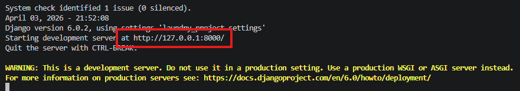<br><br>

- ปรากฏหน้า login ระบบ <br><br>

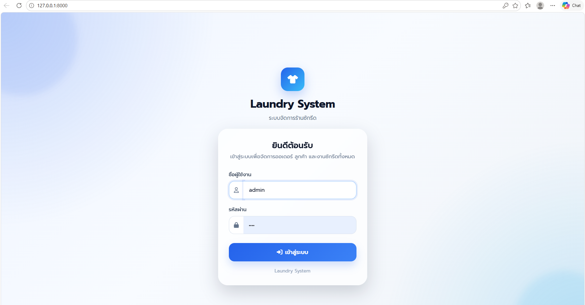<br><br>

- สามารถเข้าใช้งานได้ตามสิทธิ์ดังนี้

```bash
- เข้าสู่ระบบในฐานะ Admin ด้วย 
username : admin 
password :1234

- เข้าสู่ระบบในฐานะ พนักงาน 1 ด้วย 
username : staff01
password : staff01

- เข้าสู่ระบบในฐานะ พนักงาน 2 ด้วย 
username : staff02
password : staff02

- เข้าสู่ระบบในฐานะ พนักงาน 3 ด้วย 
username : staff03
password : staff03
```
<br><br>
- หน้าตาระบบหลังจาก login เสร็จสิ้น

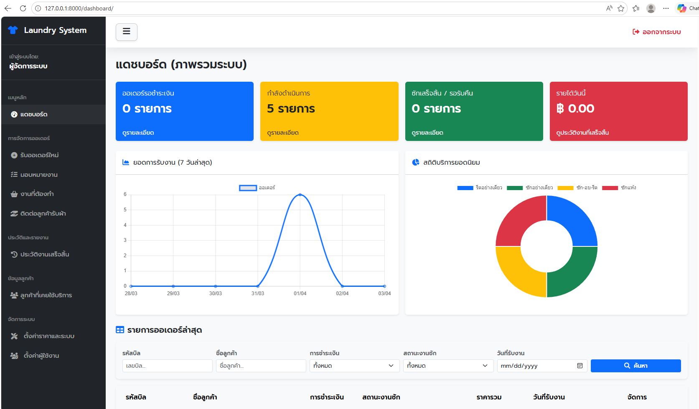<br><br>

---


